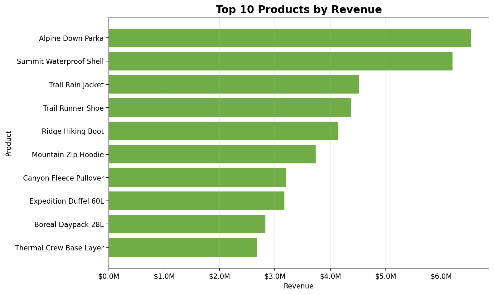

# Retail Sales and Inventory Operations Dashboard

## 2-Minute Recruiter Summary

This project analyzes a simulated outdoor retail business at the store-date-product level. It demonstrates how retail sales, inventory, customer traffic, promotions, and product performance can be turned into practical decisions for merchandising, operations, finance, and marketing teams.

Key outcome: the analysis found that premium Jackets drove the largest share of revenue, while smaller fast-moving items such as accessories and base layers created repeated low-stock risk. The final recommendation is to protect winter outerwear inventory, replenish high-velocity low-stock products more frequently, and use store traffic patterns to improve staffing and conversion.

## Data Transparency

This project uses a simulated dataset for portfolio demonstration.

The product mix is inspired by outdoor apparel retailers such as The North Face, but the data is not real The North Face data, not internal company data, and not provided by VF Corporation. Real store-level sales, inventory, customer traffic, and promotion data for The North Face is generally not publicly available.

## Business Questions

- Which stores, products, and categories generate the most revenue?
- Which products sell quickly and may need more inventory?
- Which products move slowly and may need targeted promotion?
- Are customer visits converting into transactions efficiently?
- Which stores and products may face lost sales risk from low stock?
- How should staffing, merchandising, and replenishment decisions be adjusted?

## Dataset

The dataset is simulated at the store-date-product level. Each row represents one product in one store on one date.

- File: `data/raw/retail_sales_inventory_simulated.csv`
- Time period: January 1, 2025 to December 31, 2025
- Rows: 25,550
- Stores: 5
- Products: 14
- Categories: Jackets, Fleece, Backpacks, Footwear, Base Layers, Accessories

Main fields:

- Date, store ID, store name, region
- Product category and product name
- Units sold, unit price, revenue
- Starting inventory and ending inventory level
- Customer visits, transactions, promotion flag

## Key Metrics

- Total revenue: **$47,999,180**
- Total units sold: **425,150**
- Average order value: **$193**
- Overall conversion rate: **2.8%**
- Top revenue product: **Alpine Down Parka**
- Top revenue category: **Jackets**
- Top revenue store: **Denver Outdoor Flagship**

## Selected Visuals

### Monthly Revenue Trend


### Revenue by Product Category


### Top 10 Products by Revenue



### Low-Stock Watchlist


## Business Recommendations

1. **Increase stock for fast-moving low-stock products.** Accessories and base layers such as Summit Beanie, Trail Gloves, Insulated Bottle, and Thermal Crew Base Layer should be reviewed weekly during peak months.
2. **Protect premium outerwear inventory before winter.** Jackets generated the highest revenue, so replenishment planning should begin before November and December demand peaks.
3. **Use targeted promotions for slow-moving premium products.** Avoid blanket markdowns on high-revenue outerwear. Use bundles, seasonal messaging, and in-store placement to protect margin.
4. **Improve conversion through staffing.** Schedule more floor coverage during high-traffic periods and investigate stores with lower conversion rates.
5. **Reduce lost sales risk.** Build a weekly low-stock report by store and product, then trigger replenishment before inventory reaches the low-stock threshold.

## Project Structure

```text
Retail Sales and Inventory Operations Dashboard/
+-- README.md
+-- requirements.txt
+-- data/
|   +-- raw/
|   +-- processed/
+-- notebooks/
+-- scripts/
+-- outputs/
|   +-- figures/
+-- dashboard/
+-- reports/
```

## Deliverables

- `data/raw/retail_sales_inventory_simulated.csv`: simulated raw dataset
- `data/raw/DATA_DICTIONARY.md`: data dictionary
- `data/processed/retail_sales_inventory_cleaned.csv`: cleaned analysis-ready dataset
- `notebooks/retail_sales_inventory_analysis.ipynb`: step-by-step analysis notebook
- `dashboard/app.py`: Streamlit dashboard
- `outputs/figures/`: portfolio-ready charts
- `reports/retail_operations_business_report.md`: short business report
- `reports/resume_interview_notes.md`: resume bullets and interview talking points

## Tools Used

- Python
- pandas
- matplotlib
- CSV files compatible with Excel
- Streamlit
- Jupyter Notebook

## How to Run

Install dependencies:

```text
pip install -r requirements.txt
```

Generate the simulated dataset:

```text
python scripts/generate_synthetic_retail_data.py
```

Clean the data:

```text
python scripts/clean_retail_data.py
```

Create metric tables:

```text
python scripts/analyze_retail_metrics.py
```

Create charts:

```text
python scripts/create_retail_charts.py
```

Create the business report:

```text
python scripts/create_business_report.py
```

Create the notebook:

```text
python scripts/create_analysis_notebook.py
```

Run the dashboard:

```text
streamlit run dashboard/app.py
```

## Portfolio Value

This project shows the ability to:

- Build a clear analytics project structure
- Clean and validate retail operations data
- Create business KPIs from transactional data
- Analyze sales, inventory, conversion, and product performance
- Build charts and dashboard views for stakeholders
- Translate analysis into practical business recommendations

