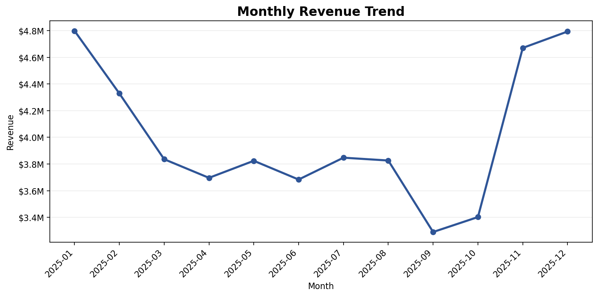
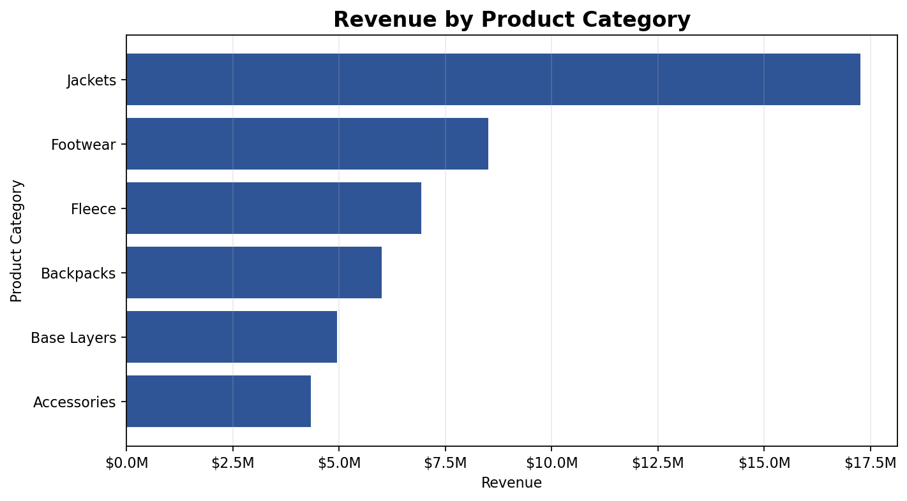
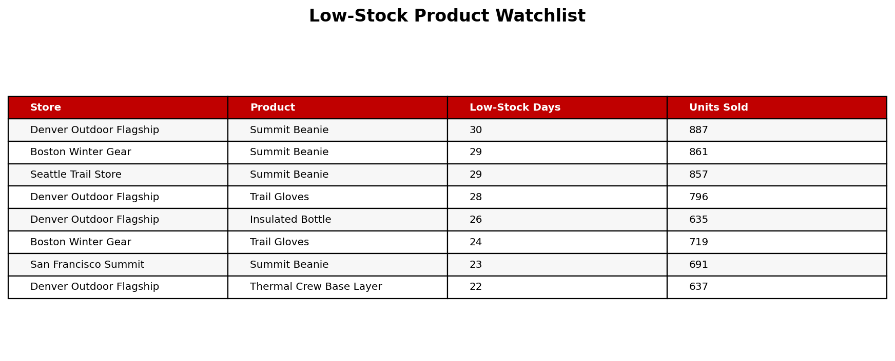

# Retail Sales and Inventory Operations Business Report

## Executive Summary

- **Jackets are the main revenue engine.** The category generated $17,264,065, led by Alpine Down Parka, the top product by revenue.
- **Inventory risk is concentrated in fast-moving smaller items.** The low-stock watchlist is led by accessories and base-layer products, which suggests replenishment should not focus only on high-ticket outerwear.
- **Denver Outdoor Flagship is the strongest revenue store.** It generated $10,727,358, making it a useful benchmark for staffing, merchandising, and replenishment planning.
- **The business should balance premium revenue with operational availability.** High-price jackets drive revenue, while frequent low-stock products may create preventable lost sales.

## Business Context and Metric Definitions

This report uses a simulated store-date-product dataset for an outdoor retail business inspired by brands such as The North Face. It is not real The North Face or VF Corporation data.

- Total revenue measures sales dollars.
- Average order value measures revenue per transaction.
- Conversion rate measures transactions divided by customer visits.
- Sell-through rate measures units sold divided by starting inventory.
- Low-stock products are products with ending inventory at or below 20 units.

## Revenue Is Concentrated in Outerwear

The simulated business generated **$47,999,180** in revenue and sold **425,150** units. The overall average order value was **$193**, while the conversion rate was **2.8%**.

The strongest revenue category was **Jackets**, which reflects the importance of premium outerwear in outdoor retail. The top revenue month was **2025-01**, with **$4,798,796** in sales, showing the seasonal importance of winter demand.

Top products by revenue:

| product_name | product_category | revenue | units_sold | average_sell_through_rate |
| --- | --- | --- | --- | --- |
| Alpine Down Parka | Jackets | $6,540,807 | 16393 | 10.09% |
| Summit Waterproof Shell | Jackets | $6,206,914 | 18866 | 11.69% |
| Trail Rain Jacket | Jackets | $4,516,344 | 23896 | 14.78% |
| Trail Runner Shoe | Footwear | $4,378,647 | 33943 | 21.00% |
| Ridge Hiking Boot | Footwear | $4,132,251 | 25989 | 16.19% |

**So what:** Merchandising and finance teams should protect availability for premium outerwear before peak winter months because these products carry large revenue impact even when unit volume is lower than accessories.

## Fast-Moving Products Need Replenishment Attention

Low-stock risk appears most often in accessories and base layers. These products may not always have the highest price, but frequent low-stock days can create missed basket-building opportunities and customer frustration.

Low-stock watchlist:

| store_name | product_name | low_stock_days | average_inventory_level | total_units_sold | total_revenue |
| --- | --- | --- | --- | --- | --- |
| Denver Outdoor Flagship | Summit Beanie | 30 | 13 | 887 | $30,158 |
| Boston Winter Gear | Summit Beanie | 29 | 13 | 861 | $29,274 |
| Seattle Trail Store | Summit Beanie | 29 | 11 | 857 | $29,138 |
| Denver Outdoor Flagship | Trail Gloves | 28 | 13 | 796 | $35,024 |
| Denver Outdoor Flagship | Insulated Bottle | 26 | 16 | 635 | $18,415 |
| Boston Winter Gear | Trail Gloves | 24 | 12 | 719 | $31,636 |
| San Francisco Summit | Summit Beanie | 23 | 13 | 691 | $23,494 |
| Denver Outdoor Flagship | Thermal Crew Base Layer | 22 | 14 | 637 | $43,953 |

**Recommendation:** Increase replenishment frequency for Summit Beanie, Trail Gloves, Insulated Bottle, and Thermal Crew Base Layer in stores with repeated low-stock days. These products should be reviewed weekly during colder months.

## Slow-Moving Products Need Targeted Promotion, Not Blanket Discounting

Some premium products generate high revenue but have lower average sell-through rates. This means they are valuable, but inventory may move more slowly because of price point, seasonality, or customer consideration time.

Slow-moving product candidates:

| product_name | product_category | revenue | units_sold | average_inventory_level | average_sell_through_rate |
| --- | --- | --- | --- | --- | --- |
| Alpine Down Parka | Jackets | $6,540,807 | 16393 | 99 | 10.09% |
| Summit Waterproof Shell | Jackets | $6,206,914 | 18866 | 97 | 11.69% |
| Expedition Duffel 60L | Backpacks | $3,174,594 | 21306 | 96 | 13.40% |
| Trail Rain Jacket | Jackets | $4,516,344 | 23896 | 94 | 14.78% |
| Ridge Hiking Boot | Footwear | $4,132,251 | 25989 | 93 | 16.19% |

**Recommendation:** Avoid broad markdowns on high-revenue outerwear. Instead, use targeted promotions, bundle offers, improved in-store placement, and seasonal messaging. For example, pair premium jackets with accessories during winter campaigns to protect margin while increasing basket size.

## Store Operations Should Use Traffic and Conversion Together

The top revenue store was **Denver Outdoor Flagship**, while **Boston Winter Gear** had the lowest conversion rate among stores in the simulation. Store planning should look at both traffic and conversion because high visits without enough transactions may point to staffing, product availability, or merchandising issues.

Store performance:

| store_name | region | revenue | units_sold | customer_visits | conversion_rate | low_stock_records |
| --- | --- | --- | --- | --- | --- | --- |
| Denver Outdoor Flagship | Mountain | $10,727,358 | 94752 | 1988392 | 2.79% | 181 |
| Boston Winter Gear | Northeast | $10,239,404 | 90751 | 1910594 | 2.78% | 166 |
| Seattle Trail Store | Pacific Northwest | $9,782,068 | 86712 | 1800554 | 2.84% | 144 |
| San Francisco Summit | West Coast | $9,295,016 | 82279 | 1704738 | 2.81% | 140 |
| Chicago Urban Outdoor | Midwest | $7,955,334 | 70656 | 1477714 | 2.78% | 70 |

**Recommendation:** Schedule more floor coverage during high-traffic periods, especially weekends and winter months. Stores with lower conversion should review checkout wait times, fitting room support, product availability, and sales associate coverage.

## Business Recommendations

1. **Increase stock for fast-moving low-stock items.** Prioritize accessories and base layers with repeated low-stock days, especially in Denver, Boston, Seattle, and San Francisco.
2. **Protect inventory for premium outerwear before winter peaks.** Jackets are the top revenue category, so replenishment planning should start before November and December.
3. **Promote slow-moving premium products selectively.** Use targeted campaigns, bundles, and visual merchandising rather than large blanket discounts that could reduce margin.
4. **Improve conversion through staffing and in-store support.** Align staff schedules with high customer visit periods and review low-conversion stores for service or availability issues.
5. **Reduce lost sales from stockouts.** Create a weekly low-stock report by store and product, then trigger replenishment when inventory drops near the low-stock threshold.

## Further Questions

- Which stores have the highest lost-sales risk during peak winter months?
- Do promoted products produce enough incremental revenue to justify discount cost?
- Which product categories have the best margin, not only the highest revenue?
- Are conversion rates lower during high-traffic periods because of staffing constraints?

## Caveats and Assumptions

- The dataset is simulated for portfolio demonstration and is not real company data.
- Product margin and discount depth are not included, so profit recommendations are directional.
- Customer visits are estimated at the product or category level for analysis purposes.
- Low-stock risk is based on ending inventory and does not directly measure actual stockouts or lost sales.
